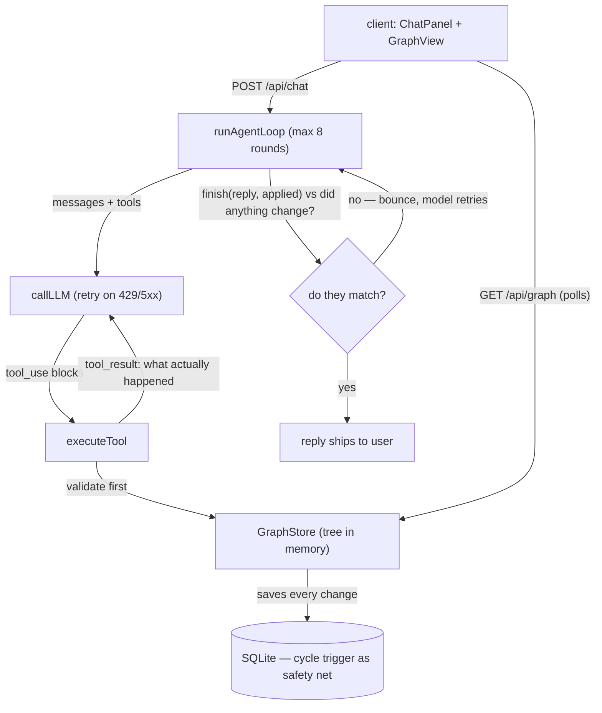

# Family Tree Builder — Take-Home Starter

This repo is a starting point, not a finished app. It gives you a working chat
UI, a working graph visualization, and a bare LLM connection with no tools
attached. Your job is everything that turns a conversation into a correct,
persisted family tree.

## What's already here

- **`client/`** — React (Vite) app with two panels:
  - `ChatPanel` — a text chat interface. Sends the full conversation to
    `POST /api/chat` on every turn and renders the reply.
  - `GraphView` — renders whatever `GET /api/graph` returns using
    [React Flow](https://reactflow.dev). It expects:
    ```
    {
      people: [{ id, name, ... }],
      parentEdges: [{ parentId, childId }],
      spouseEdges: [{ personAId, personBId }]
    }
    ```
    It lays nodes out by generation and re-fetches on an interval, so once
    your backend actually persists data, it'll show up here without any
    frontend changes.
- **`server/`** — Express app with:
  - `POST /api/chat` — stateless proxy to the model (`server/src/llm/client.js`,
    `server/src/routes/chat.js`). No tools are wired up. It can already hold a
    plain-text conversation and ask clarifying questions, but it has no way to
    read or write structured family-tree data.
  - `GET /api/graph` — currently always returns an empty graph
    (`server/src/routes/graph.js`). There is no database yet.

## What you need to build

1. **Tool definitions** the model uses to read/write the family tree (add
   person, add parent/child edge, add spouse edge, look up a person, apply a
   correction, etc. — you choose the shape).
2. **The agentic loop** in `POST /api/chat`: send messages + tools to the
   model, handle `tool_use` blocks, execute them against your persistence
   layer, feed `tool_result` blocks back, and repeat until the model returns
   plain text.
3. **A persistence layer** (SQLite is fine) that survives a process restart.
   `GET /api/graph` should read from it instead of returning the empty stub.
4. **Ambiguity and correction handling**:
   - If a reference is ambiguous (e.g. "my brother John" when two Johns
     exist), the agent should ask a clarifying question rather than guess.
   - If the user corrects an earlier statement (a misspelled name, a
     misstated relationship), state should update in place — not gain a
     duplicate or contradictory fact.
5. **DAG validation** — a parent→child edge that would create a cycle must be
   rejected, not silently accepted.

### Data model requirements

- **Person**: `id`, `name`, plus any other attributes you think are useful —
  justify your choices in your README.
- **Parent → Child**: single-direction, at most 2 parent edges per child.
- **Spouse**: explicit, undirected, distinct from parent→child. A spouse
  relationship alone never creates a parent edge.
- The graph must stay a valid DAG with respect to parent→child edges.

### Out of scope

Remarriage, half-siblings, more than 2 recorded parents, and unknown/missing
parents are out of scope. If a description happens to touch one of these, a
non-crashing response (clarifying question or a stated limitation) is fine —
you don't need to model it correctly.

## Getting started

```bash
npm install
cp server/.env.example server/.env   # then fill in ANTHROPIC_API_KEY
npm run dev
```

This starts the server (`:3001`) and client (`:5173`, proxying `/api` to the
server) together. Open the client URL and start chatting.

## Deliverables

- Your implementation (tool schema, agent loop, persistence, validation).
- A README section (append to this file or add a new one) covering:
  - Your tool schema and why you designed it that way
  - How you resolve ambiguous references and in-place corrections
  - Known limitations
- Be ready to walk through your design decisions and trade-offs in a follow-up
  discussion — not just demo the working app.


## Implementation notes

Everything above this line is the original brief, unchanged. Below: what I built and why.

### How it fits together



One message ("I am Jon, my father is Rob") flows like this:

1. The client sends the full conversation to `POST /api/chat`.
2. The loop sends the conversation + the tool list to the model.
3. The model replies with tool requests. The server runs each tool, check it against the
   tree in memory, save to SQLite, update memory and gives the results back to the model.
4. This repeats until the model ends its turn with a `finish` call.
5. The server checks the model's yes/no (`applied`) against whether any tool this turn
   actually had `changed: true` (see Reliability). Only if they match does the reply reach the user.

What the logs show for that message:

```text
find_people      { name: "Jon" }                  → no match
find_people      { name: "Rob" }                  → no match
add_person       { name: "Jon" }                  → person "1" created (changed: true)
add_person       { name: "Rob" }                  → person "2" created (changed: true)
add_parent_child { parent_id: "2", child_id: "1" } → edge created (changed: true)
finish           { reply: "…", applied: true }    → applied matches (mutations > 0) → ships
```

The tree is kept in memory for fast reading, and every change is also saved to SQLite right
away, so nothing is lost when the server restarts. The database driver is synchronous,  one
change finishes completely before anything else can run so no locking is needed. On restart
the tree is rebuilt from SQLite. `GET /api/graph` always shows the current state.

### Where things live

- `server/src/graph/store.js` — keeps the tree in memory and saves every change; all the
  checks live here (cycles, 2-parent cap, duplicate names)
- `server/src/db/db.js` — opens SQLite, creates the tables and the cycle trigger; creates the
  `data/` folder if missing so a fresh clone just works
- `server/src/agent/tools.js` — tool definitions (what the model may ask for) + the dispatcher
- `server/src/agent/loop.js` — the loop, the change counter, the finish check
- `server/src/agent/prompt.js` — rules for the model (cycles, the 2-parent cap, and
  duplicate names are also enforced in code)
- `server/src/llm/client.js` — the model call, with retries
- `server/src/routes/` — chat + graph endpoints (`/api/metrics` is in `index.js`)
- `server/test/` — store tests and loop tests (fake model, no network)

### Tool schema and why

| Tool | What it does |
|---|---|
| `find_people` | search by name; each match comes with a one-line summary of their relationships |
| `get_person` | one person with their parents, children, spouses |
| `add_person` | create a person by name; optional `context` for extra details the user gave |
| `add_parent_child` | record that A is a parent of B |
| `add_spouse` | record that A and B are spouses (never makes them parents) |
| `update_person` | fix a name or detail on an existing person |
| `remove_relationship` | remove a wrong parent or spouse link |
| `finish` | the model's last call of every turn: its reply text + yes/no "did I change the tree?" |

Why this shape:

- **Look up first, then act.** The prompt tells the model to resolve names with `find_people`
  before mutating. The server refuses unknown ids; a made-up id fails. An id from an earlier
  turn still works if that person exists.
- **Changes take ids, not names.** If two people share a name, the server never has to guess
  which "John" was meant — the model picks an id from a real search result, and the user
  confirms when names collide (next section).
- **Search results include a short relationship summary per person** (e.g. `parents: Rob /
  spouse: Mary`), built fresh from the current tree every time. This is how the model matches
  "my brother John, the one whose father is Rob" to the right person: the code works out the
  facts, the model matches them to what the user said, the code carries out the decision.
- **Doing the same change twice is safe.** Adding a link that already exists, or removing one
  that isn't there, returns "no change" instead of an error — so retries can't corrupt anything.
- **Every change result says whether the tree actually changed** (`changed: true/false`). The
  finish check is built on this field.

### Ambiguous references and in-place corrections

The rules live in the prompt: search before acting; if several people share the name, list
them and ask; never guess. But the server doesn't just trust the model to follow rules — it
blocks the wrong actions:

1. a change using an unknown id → refused;
2. a change involving a person whose name is shared by another person → refused until the
   call is retried with `confirmed: true`. The prompt tells the model to ask the user first.
   The refusal message lists the candidates, so the model learns what to do exactly when it
   needs to;
3. `add_person` with a name that already exists → warning instead of a second person. The
   model must ask the user, and only after the user says "these are two different people"
   can it retry with `allow_duplicate: true`.

What the user sees: *"I found two Johns — Mary and Steve's son, and Anna's husband. Which one
is your brother?"*

Corrections never create duplicates: a wrong name is fixed with `update_person`; a wrong
relationship is removed and the right one added. If the model still picks the wrong "John",
its confirmation message says which John it changed — so the mistake is visible and one more
message fixes it. The goal of the design: a wrong pick is always visible, never silent.

### Keeping the tree valid

A parent→child link that would create a cycle (someone being their own ancestor) is refused
twice: once in code (the main check — clear error messages, easy to test) and once by a
SQLite trigger (a safety net — the rule still holds if anything edits the database directly,
like a manual fix during debugging).

The 2-parents-per-child limit lives only in code. It's a product rule that might change
someday, and changing it should mean editing one file. The cycle rule can never change —
that's why it's the one checked twice.

### Reliability and operations

- **The finish check** — the part I'd highlight. Early in development, the model once told a
  user a change was recorded without ever calling the tool. Nothing had actually changed.
  The fix: every turn must end with a `finish` call, where the model states (a) its reply and
  (b) whether it changed the tree (`applied`). The server compares that flag to whether any
  tool this turn had `changed: true`. If they disagree, the reply is not sent. The model gets
  an error with the real count and tries again. If it never gets it right within the round
  limit, the server sends its own message based on that same yes/no. The flag cannot be a
  lie; the reply text is not checked (see Known limitations).
- If the model call fails with a rate limit or server error, it is retried twice with a short
  wait. The loop is capped at 8 rounds per message.
- `GET /api/metrics` shows counters: chat requests, model calls and retries, tool calls and
  errors, finish disagreements, and reminders the model needed.
  Every tool call also writes one JSON line to the log — the exact record of what ran:

```json
{"ts":"2025-01-01T12:00:00.000Z","level":"info","tag":"audit","msg":"tool_call","tool":"add_parent_child","input":{"parent_id":"2","child_id":"1"},"result":{"parent":{"id":"2","name":"Rob"},"child":{"id":"1","name":"Jon"},"changed":true},"ok":true,"durationMs":0}
```

- In production I would alert on: any finish disagreement, many reminders, and a rising tool
  error rate.
- The server runs as one process. Two copies at once would each hold their own tree in memory
  and disagree. The fix would be reading from the database directly, or letting only one copy
  write per conversation. Not needed at this size — noted so the limit is clear.

### Testing

`cd server && npm test` — no network and no API key needed (the model is replaced with
scripted responses).

- **Store tests**: cycles refused (direct, indirect, self), 2-parent cap, spouse dedupe in
  both orders, repeated changes report "no change", rename behavior, search, and persistence
  across a restart (write, reopen from disk, compare).
- **Loop tests**: an honest turn ships; a model that claims a change it didn't make is
  bounced and recovers; a model that says it changed nothing when it did is bounced; if the
  model never cooperates, the fallback message is still honest — and a real change made
  before the fallback is still saved.

The prompt's behavior can't be tested automatically (the model is free-form), so I checked it
with manual test conversations: two people with the same name, corrections, out-of-scope
requests. If the project continued, the next step would be a set of recorded conversations
replayed as automatic tests.

### Known limitations

- The finish check confirms the model's yes/no answer is correct. It cannot check every word
  of the reply. So in theory the model could answer correctly but still write a wrong sentence
  in the same reply (for example: says nothing changed, but the text says "Done!"). This is
  rare, because it means the model contradicting itself in a single reply. The next layer
  would be a second AI call that reads the reply and checks it against the list of real
  changes — I chose not to add it, because it too can make mistakes and it adds cost and
  delay to every message.
- No merge: if the user says "Jon and John are the same person", the assistant can't join two
  records into one. It would need to move one person's relationships onto the other record
  and delete the empty one.
- One server process, reads from memory, no login/auth — fine for this task; limits noted
  above.
- Step-parents, half-siblings, remarriage, and more than 2 parents are out of scope per the
  brief; the assistant says so and continues with what it can model.